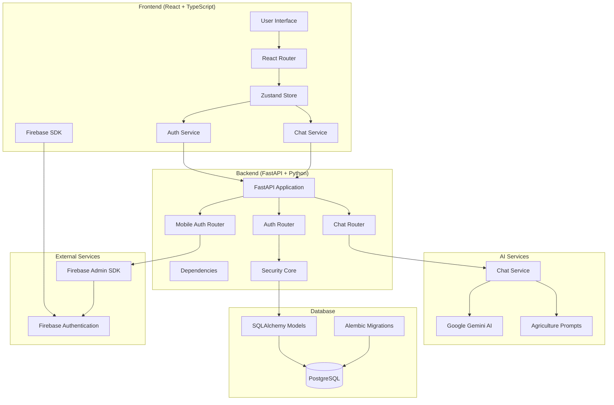
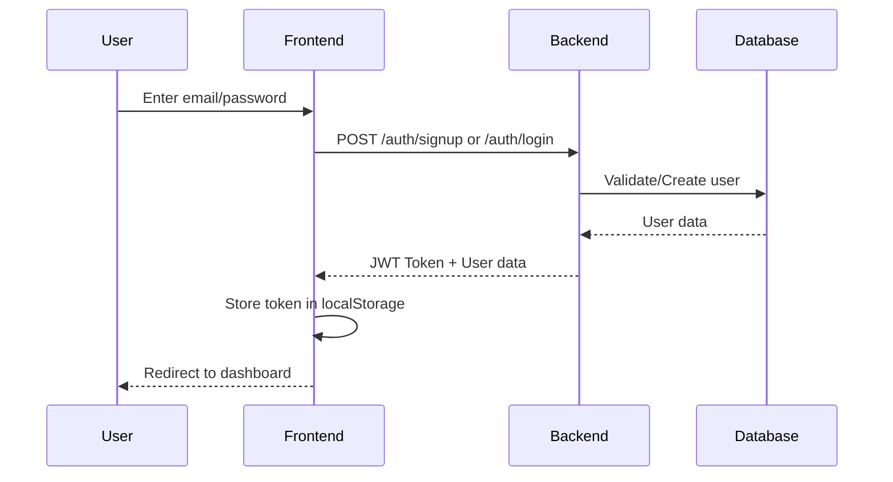
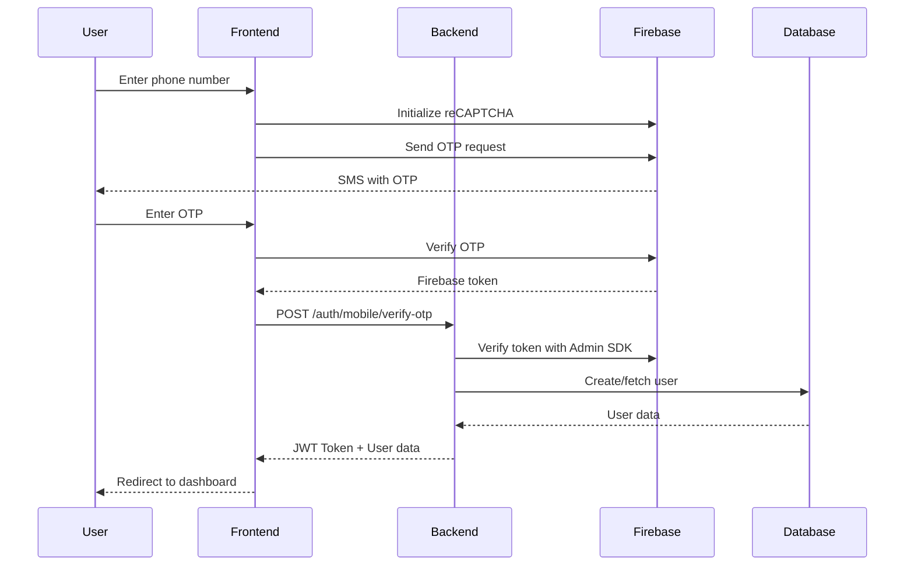
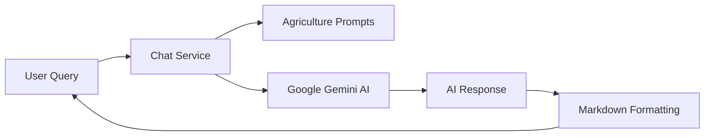
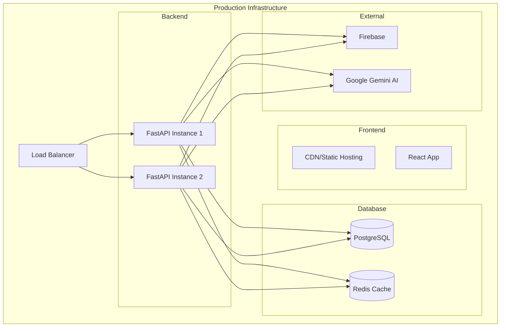

# 🌾 SmartKrishi - Architecture & Tech Stack Documentation

## 📋 Table of Contents
1. [Project Overview](#project-overview)
2. [Architecture Diagram](#architecture-diagram)
3. [Tech Stack](#tech-stack)
4. [System Architecture](#system-architecture)
5. [Database Schema](#database-schema)
6. [API Architecture](#api-architecture)
7. [Authentication Flow](#authentication-flow)
8. [AI Integration](#ai-integration)
9. [Frontend Architecture](#frontend-architecture)
10. [Deployment Architecture](#deployment-architecture)
11. [Security Implementation](#security-implementation)
12. [File Structure](#file-structure)
13. [Data Flow](#data-flow)
14. [Future Enhancements](#future-enhancements)

---

## 🎯 Project Overview

**SmartKrishi** is an AI-powered farming assistant platform designed to help Indian farmers with agricultural guidance, crop management, pest control, and market intelligence. The platform combines modern web technologies with Google's Gemini AI to provide intelligent, context-aware farming advice.

### 🔑 Key Features
- **AI-Powered Chat**: Intelligent farming assistance using Google Gemini AI
- **Multi-Modal Support**: Text and image-based queries
- **Dual Authentication**: Email/password and mobile OTP authentication
- **Real-time Communication**: WebSocket-ready architecture
- **Responsive Design**: Mobile-first approach for farmers
- **Markdown Support**: Rich text formatting for AI responses
- **Secure Backend**: JWT-based authentication with PostgreSQL

---

## 🏗️ Architecture Diagram



---

## 🛠️ Tech Stack

### **Frontend Technologies**
| Technology | Version | Purpose |
|------------|---------|---------|
| **React** | 19.1.1 | UI Framework |
| **TypeScript** | 5.8.3 | Type Safety |
| **Vite** | 7.1.0 | Build Tool & Dev Server |
| **React Router** | 7.8.0 | Client-side Routing |
| **Zustand** | 5.0.7 | State Management |
| **Tailwind CSS** | 3.x | Styling Framework |
| **Axios** | 1.11.0 | HTTP Client |
| **React Hook Form** | 7.62.0 | Form Management |
| **Zod** | 4.0.15 | Schema Validation |
| **Firebase** | 12.1.0 | Authentication |
| **React Markdown** | 10.1.0 | Markdown Rendering |
| **Highlight.js** | 11.11.1 | Code Syntax Highlighting |
| **Lucide React** | 0.539.0 | Icons |

### **Backend Technologies**
| Technology | Version | Purpose |
|------------|---------|---------|
| **FastAPI** | 0.104.1 | Web Framework |
| **Python** | 3.12+ | Programming Language |
| **PostgreSQL** | 15+ | Primary Database |
| **SQLAlchemy** | 2.0.23 | ORM |
| **Alembic** | 1.13.1 | Database Migrations |
| **Pydantic** | 2.5.0 | Data Validation |
| **Uvicorn** | 0.24.0 | ASGI Server |
| **Firebase Admin** | 7.1.0 | Authentication |
| **Google Generative AI** | 0.8.5 | AI Integration |
| **PyJWT** | 2.10.1 | JWT Tokens |
| **Bcrypt** | 4.3.0 | Password Hashing |
| **Python-Decouple** | 3.8 | Environment Management |

### **AI & External Services**
| Service | Purpose |
|---------|---------|
| **Google Gemini AI** | Natural Language Processing |
| **Firebase Authentication** | Mobile OTP & Social Auth |
| **Firebase Admin SDK** | Server-side Authentication |

### **Development & Deployment**
| Tool | Purpose |
|------|---------|
| **Docker** | Containerization |
| **Docker Compose** | Multi-container orchestration |
| **ESLint** | Code Linting |
| **Prettier** | Code Formatting |
| **Git** | Version Control |

---

## 🏛️ System Architecture

### **Three-Tier Architecture**

#### 1. **Presentation Layer** (Frontend)
- **React SPA** with TypeScript for type safety
- **Component-based architecture** with reusable UI components
- **State management** using Zustand for global state
- **Routing** handled by React Router for SPA navigation
- **Responsive design** using Tailwind CSS

#### 2. **Business Logic Layer** (Backend API)
- **FastAPI** REST API with automatic OpenAPI documentation
- **Modular router structure** for different functionalities
- **Dependency injection** for database sessions and authentication
- **Middleware** for CORS, security, and request/response handling
- **Service layer** for business logic separation

#### 3. **Data Layer** (Database & External APIs)
- **PostgreSQL** for persistent data storage
- **Firebase** for authentication services
- **Google Gemini AI** for intelligent responses
- **SQLAlchemy ORM** for database operations

---

## 📊 Database Schema

### **User Model**
```sql
CREATE TABLE users (
    id SERIAL PRIMARY KEY,
    name VARCHAR NOT NULL,
    email VARCHAR UNIQUE,
    phone_number VARCHAR UNIQUE,
    hashed_password VARCHAR,
    auth_provider auth_provider_enum NOT NULL DEFAULT 'email',
    is_active BOOLEAN DEFAULT true,
    created_at TIMESTAMP WITH TIME ZONE DEFAULT NOW(),
    updated_at TIMESTAMP WITH TIME ZONE
);

CREATE TYPE auth_provider_enum AS ENUM ('email', 'mobile');
```

### **Database Relationships**
- **User-centric design** with support for multiple authentication providers
- **Extensible schema** ready for future entities (crops, farms, chat history)
- **Proper indexing** on email and phone_number for fast lookups
- **Timezone-aware timestamps** for global compatibility

---

## 🔌 API Architecture

### **RESTful API Endpoints**

#### **Authentication Endpoints**
```
POST /api/v1/auth/signup              # Email signup
POST /api/v1/auth/login               # Email login
POST /api/v1/auth/token               # OAuth2 token
GET  /api/v1/auth/me                  # Get current user
POST /api/v1/auth/mobile/send-otp     # Send mobile OTP
POST /api/v1/auth/mobile/verify-otp   # Verify mobile OTP
```

#### **Chat Endpoints**
```
POST /api/v1/chat/ask                 # Text-based questions
POST /api/v1/chat/ask-with-image      # Image analysis questions
```

#### **System Endpoints**
```
GET  /                                # Root endpoint
GET  /health                          # Health check
GET  /docs                            # API documentation
```

### **Request/Response Models**
- **Pydantic schemas** for request validation
- **Type-safe responses** with proper status codes
- **Error handling** with detailed error messages
- **Consistent JSON structure** across all endpoints

---

## 🔐 Authentication Flow

### **Email Authentication Flow**


### **Mobile Authentication Flow**


### **Security Features**
- **JWT tokens** with configurable expiration
- **Password hashing** using bcrypt
- **Firebase token verification** for mobile auth
- **Protected routes** with dependency injection
- **CORS configuration** for cross-origin requests

---

## 🤖 AI Integration

### **Google Gemini AI Integration**


### **AI Service Architecture**
- **GeminiService**: Core AI interaction handler
- **ChatService**: Business logic wrapper for farming context
- **Agriculture Prompts**: Specialized prompts for farming assistance
- **Response Processing**: Markdown formatting and error handling

### **AI Capabilities**
- **Text Analysis**: Natural language understanding for farming queries
- **Image Analysis**: Crop disease detection and plant identification
- **Context Awareness**: Maintains chat history for better responses
- **Multilingual Support**: Configured for English responses
- **Specialized Knowledge**: Indian agriculture and farming practices

---

## 🖥️ Frontend Architecture

### **Component Structure**
```
src/
├── components/          # Reusable UI components
│   ├── ui/             # Base UI components (buttons, inputs)
│   ├── ProtectedRoutes.tsx
│   └── theme-provider.tsx
├── pages/              # Page components
│   ├── LandingPage.tsx
│   ├── DashboardPage.tsx
│   ├── LoginPage.tsx
│   └── SignupPage.tsx
├── services/           # API service layers
│   ├── auth.ts
│   └── chatService.ts
├── store/              # State management
│   └── authStore.ts
├── lib/                # Utility libraries
│   ├── firebase.ts
│   └── utils.ts
└── styles/             # Custom CSS
```

### **State Management Strategy**
- **Zustand** for global authentication state
- **React Hook Form** for form state management
- **Local state** for component-specific data
- **Persistent storage** for authentication tokens

### **Routing Strategy**
- **Protected routes** requiring authentication
- **Public routes** for landing and auth pages
- **Route guards** checking authentication status
- **Lazy loading** for code splitting (future enhancement)

---

## 🚀 Deployment Architecture

### **Development Environment**
```yaml
# docker-compose.yml
services:
  db:
    image: postgres:15
    environment:
      POSTGRES_USER: smartkrishi_user
      POSTGRES_PASSWORD: smartkrishi_password
      POSTGRES_DB: smartkrishi_db
    ports:
      - "5432:5432"
```

### **Production Deployment (Recommended)**


### **Environment Configuration**
- **Environment variables** for sensitive data
- **Configuration management** using python-decouple
- **Database migrations** using Alembic
- **Health checks** for monitoring

---

## 🔒 Security Implementation

### **Backend Security**
- **JWT Authentication** with secure token generation
- **Password Hashing** using bcrypt with salt
- **Input Validation** using Pydantic schemas
- **SQL Injection Prevention** through SQLAlchemy ORM
- **CORS Configuration** for cross-origin security
- **Rate Limiting** (ready for implementation)

### **Frontend Security**
- **Token Storage** in localStorage with expiration
- **Route Protection** checking authentication status
- **Input Sanitization** through form validation
- **HTTPS Enforcement** (production requirement)
- **Content Security Policy** (future enhancement)

### **API Security**
- **Request Validation** at multiple layers
- **Error Handling** without exposing sensitive information
- **Dependency Injection** for secure database access
- **Firebase Token Verification** for mobile auth

---

## 📁 File Structure

### **Backend Structure**
```
backend/
├── app/
│   ├── __init__.py
│   ├── main.py              # FastAPI application entry point
│   ├── deps.py              # Dependency injection functions
│   ├── core/
│   │   └── security.py      # Authentication & security utilities
│   ├── db/
│   │   └── database.py      # Database configuration
│   ├── models/
│   │   └── user.py          # SQLAlchemy models
│   ├── schemas/
│   │   └── user.py          # Pydantic schemas
│   ├── routers/
│   │   ├── auth.py          # Authentication endpoints
│   │   ├── mobile_auth.py   # Mobile authentication
│   │   └── chat.py          # Chat endpoints
│   ├── services/
│   │   └── firebase_service.py  # Firebase integration
│   └── ai/
│       ├── gemini_service.py    # Google Gemini AI
│       ├── chat_service.py      # Chat business logic
│       └── prompts/
│           └── agriculture_prompts.py  # AI prompts
├── alembic/                 # Database migrations
├── requirements.txt         # Python dependencies
├── docker-compose.yml       # Development database
└── README.md
```

### **Frontend Structure**
```
frontend/
├── src/
│   ├── App.tsx             # Main application component
│   ├── main.tsx            # Application entry point
│   ├── components/
│   │   ├── ui/             # Reusable UI components
│   │   ├── ProtectedRoutes.tsx
│   │   └── theme-provider.tsx
│   ├── pages/              # Page components
│   ├── services/           # API integration
│   ├── store/              # State management
│   ├── lib/                # Utility functions
│   └── styles/             # Custom CSS
├── public/                 # Static assets
├── package.json           # Node.js dependencies
├── tailwind.config.js     # Tailwind CSS configuration
├── vite.config.ts         # Vite build configuration
└── README.md
```

---

## 🔄 Data Flow

### **User Registration Flow**
1. **User Input** → Frontend form validation
2. **API Request** → Backend endpoint with validation
3. **Password Hashing** → Secure storage preparation
4. **Database Storage** → User record creation
5. **Token Generation** → JWT token creation
6. **Response** → Token and user data to frontend
7. **State Update** → Authentication state management

### **Chat Interaction Flow**
1. **User Query** → Text or image input
2. **Authentication Check** → Verify user session
3. **API Request** → Send to chat endpoint
4. **AI Processing** → Gemini AI analysis
5. **Response Generation** → Agriculture-specific response
6. **Markdown Rendering** → Rich text formatting
7. **UI Update** → Display in chat interface

### **Mobile Authentication Flow**
1. **Phone Input** → Number validation
2. **Firebase reCAPTCHA** → Bot protection
3. **OTP Generation** → Firebase SMS service
4. **OTP Verification** → Firebase validation
5. **Token Exchange** → Firebase to JWT conversion
6. **User Management** → Database operations
7. **Session Creation** → Authentication state

---

## 🚀 Future Enhancements

### **Technical Improvements**
- [ ] **WebSocket Integration** for real-time chat
- [ ] **Redis Caching** for improved performance
- [ ] **CDN Integration** for static asset delivery
- [ ] **Container Orchestration** with Kubernetes
- [ ] **Microservices Architecture** for scalability
- [ ] **API Gateway** for centralized routing
- [ ] **Monitoring & Logging** with ELK stack
- [ ] **Automated Testing** with pytest and Jest

### **Feature Enhancements**
- [ ] **Multi-language Support** (Hindi, regional languages)
- [ ] **Voice Input/Output** for accessibility
- [ ] **Offline Mode** with service workers
- [ ] **Push Notifications** for alerts
- [ ] **Farm Management** tools integration
- [ ] **Weather API** integration
- [ ] **Marketplace Integration** for crop selling
- [ ] **Community Features** (forums, expert connect)

### **AI Enhancements**
- [ ] **Crop Disease Detection** with computer vision
- [ ] **Yield Prediction** models
- [ ] **Weather-based Recommendations**
- [ ] **Market Price Analysis**
- [ ] **Personalized Farming Plans**
- [ ] **Historical Data Analysis**

### **Security Enhancements**
- [ ] **Two-Factor Authentication** (2FA)
- [ ] **Rate Limiting** implementation
- [ ] **Content Security Policy** (CSP)
- [ ] **Data Encryption** at rest
- [ ] **Audit Logging** for compliance
- [ ] **Penetration Testing** regular assessments

---

## 📞 Support & Maintenance

### **Development Team Structure**
- **Backend Developer**: FastAPI, AI integration, database
- **Frontend Developer**: React, TypeScript, UI/UX
- **DevOps Engineer**: Deployment, monitoring, scaling
- **AI/ML Engineer**: Model optimization, prompt engineering

### **Monitoring & Analytics**
- **Application Performance Monitoring** (APM)
- **Error Tracking** and alerting
- **User Analytics** for feature usage
- **Database Performance** monitoring
- **AI Response Quality** metrics

---

*This documentation serves as a comprehensive guide to the SmartKrishi platform architecture and will be updated as the system evolves.*

**Last Updated**: August 12, 2025  
**Version**: 1.0.0  
**Authors**: SmartKrishi Development Team
