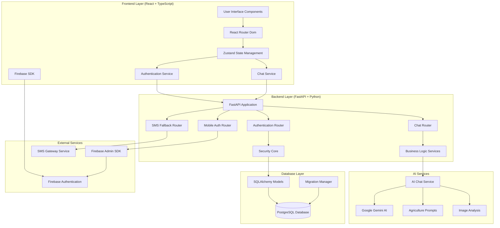
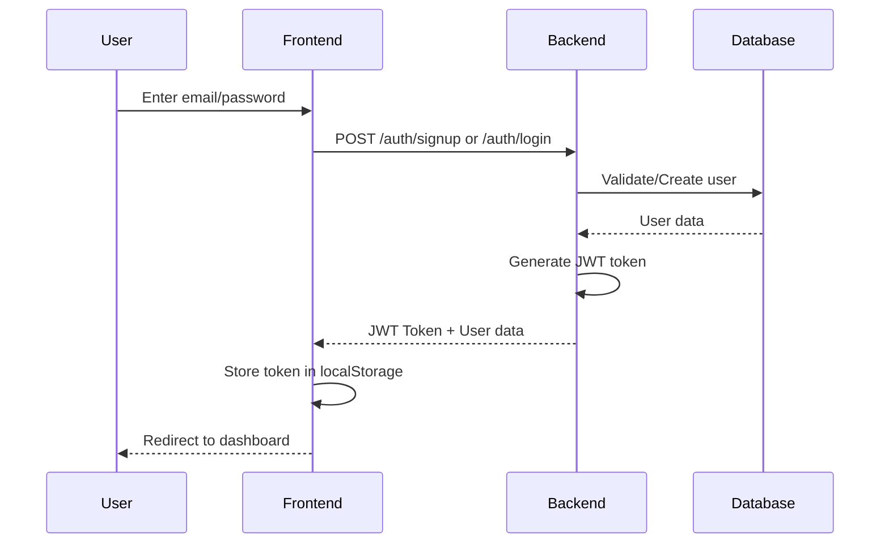
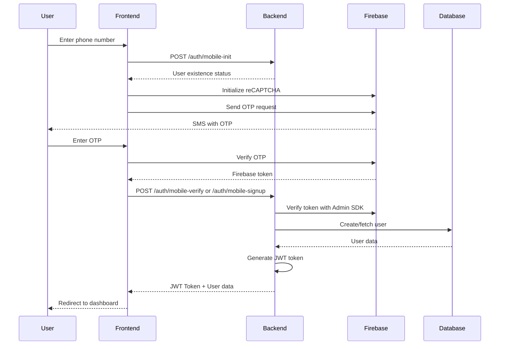
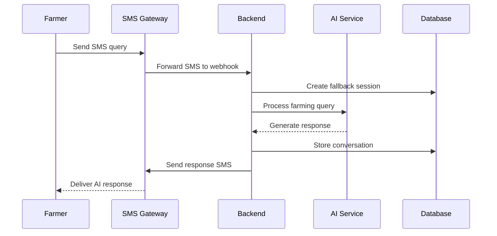

# 🌾 SmartKrishi - Complete Architecture & Tech Stack Documentation

## 📋 Table of Contents
1. [Project Overview](#-project-overview)
2. [Architecture Diagram](#️-architecture-diagram)
3. [Tech Stack](#️-tech-stack)
4. [System Architecture](#️-system-architecture)
5. [Database Schema](#-database-schema)
6. [API Architecture](#-api-architecture)
7. [Authentication Flow](#-authentication-flow)
8. [AI Integration](#-ai-integration)
9. [SMS Fallback System](#-sms-fallback-system)
10. [Frontend Architecture](#️-frontend-architecture)
11. [Deployment Architecture](#-deployment-architecture)
12. [Security Implementation](#-security-implementation)
13. [File Structure](#-file-structure)
14. [Data Flow](#-data-flow)
15. [Development Workflow](#️-development-workflow)
16. [Future Enhancements](#-future-enhancements)

---

## 🎯 Project Overview

**SmartKrishi** is an AI-powered agricultural assistant platform designed to help farmers make informed decisions through intelligent chat-based interactions. The platform combines modern web technologies with advanced AI capabilities to provide farming insights, crop management advice, and agricultural knowledge.

### **Key Features**
- 🤖 **AI-Powered Chat**: Gemini AI integration for agriculture-specific advice
- 📱 **Multi-Platform Auth**: Email and mobile phone authentication
- 📊 **Chat History**: Persistent conversation management
- 📸 **Image Analysis**: Crop disease detection and plant identification
- 📱 **SMS Fallback**: Offline communication via SMS for low-connectivity areas
- 🌐 **Responsive Design**: Works across desktop and mobile devices
- 🔒 **Secure**: JWT-based authentication with Firebase integration

---

## 🏗️ Architecture Diagram



---

## 🛠️ Tech Stack

### **Frontend Technologies**
| Technology | Version | Purpose |
|------------|---------|---------|
| **React** | 19.1.1 | UI Library |
| **TypeScript** | 5.8.3 | Type Safety |
| **Vite** | 7.1.0 | Build Tool & Dev Server |
| **React Router Dom** | 7.8.0 | Client-side Routing |
| **Zustand** | 5.0.7 | State Management |
| **Tailwind CSS** | 3.x | Utility-first Styling |
| **Framer Motion** | 12.23.12 | Animations |
| **React Hook Form** | 7.62.0 | Form Management |
| **Zod** | 4.0.15 | Schema Validation |
| **Axios** | 1.11.0 | HTTP Client |
| **React Markdown** | 10.1.0 | Markdown Rendering |
| **React Icons** | 5.5.0 | Icon Library |
| **Lucide React** | 0.539.0 | Modern Icons |

### **Backend Technologies**
| Technology | Version | Purpose |
|------------|---------|---------|
| **FastAPI** | 0.115.8 | Web Framework |
| **Python** | 3.12+ | Programming Language |
| **PostgreSQL** | 15+ | Primary Database |
| **SQLAlchemy** | 2.0.36 | ORM |
| **Alembic** | 1.13.3 | Database Migrations |
| **Pydantic** | 2.10.3 | Data Validation |
| **Uvicorn** | 0.32.0 | ASGI Server |
| **PyJWT** | 2.10.1 | JWT Tokens |
| **Bcrypt** | 4.3.0 | Password Hashing |
| **Python Decouple** | 3.8 | Configuration Management |
| **Passlib** | 1.7.4 | Password Utilities |
| **Python Multipart** | 0.0.12 | File Upload Support |

### **AI & External Services**
| Service | Purpose |
|---------|---------|
| **Google Gemini AI** | Natural Language Processing & Image Analysis |
| **Firebase Authentication** | Mobile OTP & Social Authentication |
| **Firebase Admin SDK** | Server-side Authentication Verification |
| **SMS Gateway** | Fallback Communication Service |

### **Development & Deployment**
| Tool | Purpose |
|------|---------|
| **Docker** | Containerization |
| **Docker Compose** | Multi-container Development |
| **ESLint** | Code Linting |
| **TypeScript ESLint** | TypeScript Linting |
| **Render** | Backend Hosting |
| **Vercel** | Frontend Hosting |
| **Git** | Version Control |
| **Alembic** | Database Schema Management |

---

## 🏛️ System Architecture

### **Three-Tier Architecture**

#### **1. Presentation Layer (Frontend)**
- **React SPA**: Single Page Application with TypeScript
- **Responsive Design**: Mobile-first approach with Tailwind CSS
- **State Management**: Zustand for global state
- **Routing**: React Router for client-side navigation
- **Real-time UI**: Framer Motion animations

#### **2. Business Logic Layer (Backend)**
- **FastAPI Framework**: High-performance async API
- **Modular Routing**: Separated concerns for auth, chat, mobile, fallback
- **Service Layer**: Business logic abstraction
- **Middleware**: CORS, authentication, error handling
- **Background Tasks**: Async processing for heavy operations

#### **3. Data Layer**
- **PostgreSQL**: Primary relational database
- **SQLAlchemy ORM**: Database abstraction
- **Alembic Migrations**: Version-controlled schema changes
- **Connection Pooling**: Efficient database connections

---

## 📊 Database Schema

### **Core Tables**

#### **Users Table**
```sql
CREATE TABLE users (
    id SERIAL PRIMARY KEY,
    name VARCHAR NOT NULL,
    email VARCHAR UNIQUE,
    phone_number VARCHAR UNIQUE,
    hashed_password VARCHAR,
    auth_provider auth_provider_enum NOT NULL DEFAULT 'email',
    is_active BOOLEAN DEFAULT true,
    created_at TIMESTAMP WITH TIME ZONE DEFAULT NOW(),
    updated_at TIMESTAMP WITH TIME ZONE,
    
    -- SMS Fallback fields
    auto_fallback_enabled BOOLEAN DEFAULT false,
    fallback_mode VARCHAR(20) DEFAULT 'manual',
    fallback_active BOOLEAN DEFAULT false,
    fallback_phone VARCHAR,
    fallback_phone_verified BOOLEAN DEFAULT false,
    whatsapp_user_id VARCHAR UNIQUE
);

CREATE TYPE auth_provider_enum AS ENUM ('email', 'mobile');
```

#### **Chats Table**
```sql
CREATE TABLE chats (
    id UUID PRIMARY KEY DEFAULT gen_random_uuid(),
    user_id INTEGER REFERENCES users(id) NOT NULL,
    title VARCHAR(255) NOT NULL,
    is_fallback_chat BOOLEAN DEFAULT false,
    fallback_phone_number VARCHAR(20),
    created_at TIMESTAMP WITH TIME ZONE DEFAULT NOW(),
    updated_at TIMESTAMP WITH TIME ZONE DEFAULT NOW(),
    is_deleted BOOLEAN DEFAULT false
);
```

#### **Chat Messages Table**
```sql
CREATE TABLE chat_messages (
    id UUID PRIMARY KEY DEFAULT gen_random_uuid(),
    chat_id UUID REFERENCES chats(id) NOT NULL,
    user_id INTEGER REFERENCES users(id) NOT NULL,
    role VARCHAR(20) NOT NULL, -- 'user' or 'assistant'
    content TEXT NOT NULL,
    message_type VARCHAR(20) DEFAULT 'text', -- 'text', 'image', 'file'
    file_url VARCHAR(500),
    is_edited BOOLEAN DEFAULT false,
    original_content TEXT,
    fallback_type VARCHAR(20), -- 'sms', 'whatsapp' if from fallback
    fallback_phone_number VARCHAR(20),
    created_at TIMESTAMP WITH TIME ZONE DEFAULT NOW(),
    edited_at TIMESTAMP WITH TIME ZONE
);
```

#### **Fallback Sessions Table**
```sql
CREATE TABLE fallback_sessions (
    id SERIAL PRIMARY KEY,
    user_id INTEGER REFERENCES users(id) NOT NULL,
    chat_id UUID REFERENCES chats(id),
    phone_number VARCHAR(20) NOT NULL,
    fallback_type VARCHAR(20) DEFAULT 'sms',
    is_active BOOLEAN DEFAULT true,
    activation_trigger VARCHAR(20) NOT NULL,
    activated_at TIMESTAMP WITH TIME ZONE DEFAULT NOW(),
    deactivated_at TIMESTAMP WITH TIME ZONE
);
```

#### **Fallback Messages Table**
```sql
CREATE TABLE fallback_messages (
    id SERIAL PRIMARY KEY,
    session_id INTEGER REFERENCES fallback_sessions(id) NOT NULL,
    user_id INTEGER REFERENCES users(id) NOT NULL,
    phone_number VARCHAR(20) NOT NULL,
    message_type VARCHAR(20) NOT NULL, -- 'inbound', 'outbound', 'system'
    content TEXT NOT NULL,
    fallback_type VARCHAR(20) DEFAULT 'sms',
    sms_id VARCHAR,
    is_delivered BOOLEAN DEFAULT false,
    delivered_at TIMESTAMP WITH TIME ZONE,
    created_at TIMESTAMP WITH TIME ZONE DEFAULT NOW()
);
```

### **Database Relationships**
- **User → Chats**: One-to-Many (User can have multiple chats)
- **Chat → Messages**: One-to-Many (Chat contains multiple messages)
- **User → Fallback Sessions**: One-to-Many (User can have multiple fallback sessions)
- **Fallback Session → Messages**: One-to-Many (Session contains multiple messages)

---

## 🔌 API Architecture

### **RESTful API Endpoints**

#### **Authentication Endpoints**
```
POST   /api/v1/auth/signup           # Email/password registration
POST   /api/v1/auth/login            # Email/password authentication
GET    /api/v1/auth/me               # Get current user profile
POST   /api/v1/auth/mobile-init      # Initialize mobile authentication
POST   /api/v1/auth/mobile-verify    # Verify OTP for existing user
POST   /api/v1/auth/mobile-signup    # Complete mobile registration
```

#### **Chat Endpoints**
```
GET    /api/v1/chat/chats            # Get user's chat list
POST   /api/v1/chat/chats            # Create new chat
GET    /api/v1/chat/chats/{chat_id}  # Get specific chat with messages
PUT    /api/v1/chat/chats/{chat_id}  # Update chat (rename)
DELETE /api/v1/chat/chats/{chat_id}  # Delete chat
POST   /api/v1/chat/send-message     # Send message to AI
POST   /api/v1/chat/analyze-image    # Analyze crop image
POST   /api/v1/chat/ask              # Legacy chat endpoint
```

#### **Fallback/SMS Endpoints**
```
GET    /api/v1/fallback/settings     # Get user's fallback settings
PUT    /api/v1/fallback/settings     # Update fallback settings
POST   /api/v1/fallback/verify-phone # Verify phone number
GET    /api/v1/fallback/chats        # Get fallback chats
GET    /api/v1/fallback/health       # Get fallback system health
POST   /api/v1/fallback/sms/send     # Send SMS directly (testing)
GET    /api/v1/fallback/sms/receive  # Receive SMS (polling)
GET    /api/v1/fallback/normal-chats # Get non-fallback chats
```

### **Request/Response Models**
- **Pydantic Schemas**: Type-safe request/response validation
- **Error Handling**: Standardized error responses with proper HTTP codes
- **Pagination**: Built-in pagination for list endpoints
- **File Upload**: Support for image uploads with validation

---

## 🔐 Authentication Flow

### **Email Authentication Flow**


### **Mobile Authentication Flow**


### **Security Features**
- **JWT Tokens**: Stateless authentication with configurable expiration
- **Password Hashing**: Bcrypt with salt for secure password storage
- **Firebase Integration**: Secure mobile authentication with OTP
- **Protected Routes**: Dependency injection for route protection
- **CORS Configuration**: Proper cross-origin resource sharing
- **Rate Limiting**: API rate limiting with SlowAPI
- **Input Validation**: Pydantic schemas for request validation

---

## 🤖 AI Integration

### **Google Gemini AI Integration**


### **AI Service Architecture**
- **GeminiService**: Core AI interaction handler with async support
- **ChatService**: Business logic wrapper for farming-specific context
- **Agriculture Prompts**: Specialized prompts for farming assistance
- **Image Analysis**: Crop disease detection and plant identification
- **Response Processing**: Markdown formatting and error handling

### **AI Capabilities**
- **Text Analysis**: Natural language understanding for farming queries
- **Image Processing**: Upload and analyze crop/plant images
- **Context Awareness**: Maintains chat history for better responses
- **Error Handling**: Graceful degradation when AI service is unavailable
- **Specialized Knowledge**: Focus on Indian agriculture and farming practices
- **Multi-modal Input**: Support for both text and image inputs

### **AI Service Configuration**
```python
class GeminiService:
    def __init__(self):
        api_key = config("GEMINI_API_KEY")
        genai.configure(api_key=api_key)
        self.model = genai.GenerativeModel('gemini-2.5-flash')
    
    async def generate_response(self, message: str, 
                              chat_history: Optional[List[Dict]] = None,
                              system_prompt: Optional[str] = None) -> str:
        # AI processing logic
    
    async def generate_response_with_image(self, message: str,
                                         image_data: bytes,
                                         image_mime_type: str = "image/jpeg") -> str:
        # Image analysis logic
```

---

## 📱 SMS Fallback System

### **Fallback Architecture**
The SMS fallback system provides offline access to SmartKrishi when users have limited internet connectivity.

#### **Key Components**
- **Fallback Settings**: User preferences for SMS fallback
- **SMS Gateway Integration**: External SMS service for sending/receiving
- **Session Management**: Track active fallback conversations
- **Message Synchronization**: Sync SMS conversations with main chat

#### **Fallback Flow**


#### **Features**
- **Auto-fallback**: Automatic activation based on connectivity
- **Manual activation**: User can manually enable SMS mode
- **Phone verification**: Verify phone numbers for SMS delivery
- **Message history**: SMS conversations saved in database
- **Health monitoring**: Track SMS system status

---

## 🖥️ Frontend Architecture

### **Component Structure**
```
src/
├── components/           # Reusable UI components
│   ├── ui/              # Base UI components
│   │   ├── button.tsx
│   │   ├── input.tsx
│   │   ├── chat-input.tsx
│   │   ├── message.tsx
│   │   ├── navbar.tsx
│   │   ├── history-drawer.tsx
│   │   └── settings-modal.tsx
│   ├── ProtectedRoutes.tsx
│   └── theme-provider.tsx
├── pages/               # Page components
│   ├── AuthPage.tsx     # Unified authentication
│   ├── LandingPage.tsx  # Marketing/landing page
│   └── DashboardPage.tsx # Main chat interface
├── services/            # API services
│   ├── auth.ts          # Authentication service
│   └── chatService.ts   # Chat API calls
├── store/               # State management
│   └── authStore.ts     # Zustand auth store
├── lib/                 # Utility libraries
│   └── firebase.ts      # Firebase configuration
├── hooks/               # Custom React hooks
│   └── useAuthInit.ts   # Authentication initialization
└── utils/               # Helper functions
```

### **State Management Strategy**
- **Zustand Store**: Lightweight state management for authentication
- **Local Component State**: React useState for component-specific state
- **Persistent Storage**: localStorage for auth tokens
- **Real-time Updates**: Immediate UI updates with optimistic rendering

### **Routing Strategy**
- **Protected Routes**: Authentication-required routes
- **Public Routes**: Landing page and authentication
- **Route Guards**: Automatic redirects based on auth state
- **Lazy Loading**: Code splitting for better performance

### **Styling Approach**
- **Tailwind CSS**: Utility-first styling framework
- **Component Variants**: Class Variance Authority for component styles
- **Responsive Design**: Mobile-first responsive breakpoints
- **Dark Mode Ready**: Theme provider for dark/light mode support
- **Animations**: Framer Motion for smooth transitions

---

## 🚀 Deployment Architecture

### **Development Environment**
```yaml
# docker-compose.yml
services:
  db:
    image: postgres:15
    environment:
      POSTGRES_USER: smartkrishi_user
      POSTGRES_PASSWORD: smartkrishi_password
      POSTGRES_DB: smartkrishi_db
    ports:
      - "5432:5432"
    volumes:
      - postgres_data:/var/lib/postgresql/data
```

### **Production Deployment**

#### **Backend (Render)**
```yaml
# render.yaml
services:
  - type: web
    name: smartkrishi-backend
    env: python
    buildCommand: cd backend && chmod +x render-build.sh && ./render-build.sh
    startCommand: cd backend && uvicorn app.main:app --host 0.0.0.0 --port $PORT
    envVars:
      - key: DATABASE_URL
        fromDatabase:
          name: smartkrishi-postgres
          property: connectionString
      - key: SECRET_KEY
        sync: false
      - key: GEMINI_API_KEY
        sync: false
      - key: FIREBASE_CREDENTIALS
        sync: false

databases:
  - name: smartkrishi-postgres
    plan: free
    databaseName: smartkrishi_db
    user: smartkrishi_user
```

#### **Frontend (Vercel)**
- **Automatic Deployments**: GitHub integration for CI/CD
- **Environment Variables**: Secure configuration management
- **CDN Distribution**: Global content delivery network
- **Build Optimization**: Vite build optimization

### **Environment Configuration**
| Environment | Backend URL | Frontend URL | Database |
|-------------|-------------|--------------|----------|
| Development | localhost:8000 | localhost:5173 | Docker PostgreSQL |
| Production | Render.com | Vercel.app | Render PostgreSQL |

---

## 🔒 Security Implementation

### **Backend Security**
- **JWT Authentication**: Stateless token-based authentication
- **Password Hashing**: Bcrypt with salt for secure password storage
- **CORS Configuration**: Restricted origins for API access
- **Input Validation**: Pydantic schemas for all API inputs
- **SQL Injection Prevention**: SQLAlchemy ORM parameterized queries
- **Rate Limiting**: API rate limiting to prevent abuse
- **Environment Variables**: Sensitive data stored in environment variables

### **Frontend Security**
- **Token Storage**: Secure storage of JWT tokens in localStorage
- **Route Protection**: Protected routes with authentication guards
- **Input Sanitization**: Form validation with Zod schemas
- **HTTPS Only**: Production deployments use HTTPS
- **Content Security Policy**: CSP headers for XSS prevention

### **Firebase Security**
- **reCAPTCHA**: Bot protection for mobile authentication
- **Token Verification**: Server-side Firebase token verification
- **Rate Limiting**: Firebase built-in rate limiting for OTP
- **Secure Configuration**: Environment-based Firebase configuration

---

## 📁 File Structure

### **Backend Structure**
```
backend/
├── app/
│   ├── __init__.py
│   ├── main.py                    # FastAPI application entry point
│   ├── deps.py                    # Dependency injection functions
│   ├── core/
│   │   ├── __init__.py
│   │   └── security.py            # JWT & password utilities
│   ├── db/
│   │   ├── __init__.py
│   │   └── database.py            # SQLAlchemy configuration
│   ├── models/
│   │   ├── __init__.py
│   │   ├── user.py                # User model
│   │   ├── chat.py                # Chat & Message models
│   │   └── fallback.py            # SMS fallback models
│   ├── schemas/
│   │   ├── __init__.py
│   │   ├── user.py                # User Pydantic schemas
│   │   ├── chat.py                # Chat Pydantic schemas
│   │   └── fallback.py            # Fallback Pydantic schemas
│   ├── routers/
│   │   ├── __init__.py
│   │   ├── auth.py                # Authentication endpoints
│   │   ├── mobile_auth.py         # Mobile authentication
│   │   ├── chat.py                # Chat endpoints
│   │   └── fallback.py            # SMS fallback endpoints
│   ├── services/
│   │   ├── chat_service.py        # Chat business logic
│   │   ├── fallback_service.py    # SMS fallback service
│   │   ├── firebase_service.py    # Firebase integration
│   │   └── sms_service.py         # SMS gateway integration
│   └── ai/
│       ├── chat_service.py        # AI chat orchestration
│       ├── gemini_service.py      # Google Gemini AI client
│       └── prompts/
│           └── agriculture_prompts.py  # Specialized AI prompts
├── alembic/                       # Database migrations
│   ├── env.py                     # Alembic environment
│   ├── script.py.mako             # Migration template
│   └── versions/                  # Migration files
├── tests/                         # Test suite
├── requirements.txt               # Python dependencies
├── alembic.ini                    # Alembic configuration
├── docker-compose.yml             # Development database
└── README.md                      # Backend documentation
```

### **Frontend Structure**
```
frontend/
├── src/
│   ├── components/                # Reusable components
│   │   ├── ui/                    # Base UI components
│   │   │   ├── button.tsx
│   │   │   ├── input.tsx
│   │   │   ├── card.tsx
│   │   │   ├── chat-input.tsx
│   │   │   ├── message.tsx
│   │   │   ├── navbar.tsx
│   │   │   ├── history-drawer.tsx
│   │   │   ├── settings-modal.tsx
│   │   │   └── fallback-settings.tsx
│   │   ├── ProtectedRoutes.tsx    # Route protection
│   │   └── theme-provider.tsx     # Theme context
│   ├── pages/                     # Page components
│   │   ├── AuthPage.tsx           # Unified authentication
│   │   ├── LandingPage.tsx        # Landing/marketing page
│   │   ├── DashboardPage.tsx      # Main chat interface
│   │   ├── MobileAuthPage.tsx     # Mobile-specific auth
│   │   └── SignupPage.tsx         # Registration page
│   ├── services/                  # API services
│   │   ├── auth.ts                # Authentication API calls
│   │   └── chatService.ts         # Chat API calls
│   ├── store/                     # State management
│   │   └── authStore.ts           # Zustand authentication store
│   ├── lib/                       # Utility libraries
│   │   └── firebase.ts            # Firebase SDK configuration
│   ├── hooks/                     # Custom React hooks
│   │   └── useAuthInit.ts         # Auth initialization hook
│   ├── utils/                     # Helper functions
│   ├── styles/                    # Global styles
│   └── assets/                    # Static assets
├── public/                        # Public assets
├── package.json                   # NPM dependencies
├── tsconfig.json                  # TypeScript configuration
├── tailwind.config.js             # Tailwind CSS configuration
├── vite.config.ts                 # Vite build configuration
└── README.md                      # Frontend documentation
```

---

## 🔄 Data Flow

### **User Registration Flow**
1. **User Input** → Frontend form validation with Zod
2. **API Request** → Backend endpoint with Pydantic validation
3. **Password Hashing** → Bcrypt secure storage preparation
4. **Database Storage** → SQLAlchemy user record creation
5. **Token Generation** → JWT token creation with expiration
6. **Response** → Token and sanitized user data to frontend
7. **State Update** → Zustand store authentication state update

### **Chat Interaction Flow**
1. **User Query** → Text input or image upload via chat interface
2. **Authentication Check** → JWT token verification
3. **API Request** → Send to appropriate chat endpoint
4. **AI Processing** → Gemini AI analysis with agriculture context
5. **Response Generation** → AI-generated farming advice
6. **Database Storage** → Store conversation in chat_messages table
7. **Markdown Rendering** → Rich text formatting with React Markdown
8. **UI Update** → Real-time message display in chat interface

### **Mobile Authentication Flow**
1. **Phone Input** → Phone number validation and formatting
2. **Existence Check** → Check if user exists in database
3. **Firebase Setup** → Initialize reCAPTCHA for bot protection
4. **OTP Request** → Firebase sends SMS with verification code
5. **OTP Verification** → User enters code, Firebase validates
6. **Token Exchange** → Firebase token exchanged for JWT
7. **User Creation/Login** → Create new user or authenticate existing
8. **Session Start** → Store JWT and redirect to dashboard

### **Image Analysis Flow**
1. **File Upload** → User selects crop/plant image
2. **Validation** → Check file type, size, and format
3. **Upload Processing** → Convert image to base64 or stream
4. **AI Analysis** → Gemini Vision API processes image
5. **Response Generation** → AI provides analysis and recommendations
6. **Storage** → Save conversation with image reference
7. **Display** → Show analysis results with image preview

---

## ⚙️ Development Workflow

### **Backend Development**
```bash
# Setup virtual environment
python -m venv venv
source venv/bin/activate  # On Windows: venv\Scripts\activate

# Install dependencies
pip install -r requirements.txt

# Setup database
docker-compose up -d db
alembic upgrade head

# Run development server
uvicorn app.main:app --reload --host 0.0.0.0 --port 8000
```

### **Frontend Development**
```bash
# Install dependencies
pnpm install

# Run development server
pnpm dev

# Build for production
pnpm build

# Preview production build
pnpm preview
```

### **Database Migrations**
```bash
# Create new migration
alembic revision --autogenerate -m "Description of changes"

# Apply migrations
alembic upgrade head

# Rollback migration
alembic downgrade -1
```

### **Testing**
```bash
# Backend tests
pytest tests/

# Frontend tests (when implemented)
npm run test
```

---

## 🚀 Future Enhancements

### **Short-term Goals (3-6 months)**
- **Weather Integration**: Real-time weather data and farming advice
- **Market Prices**: Current market prices for crops
- **Pest Identification**: Advanced pest and disease identification
- **Multilingual Support**: Hindi and regional language support
- **Voice Input**: Voice-to-text for farmers with limited literacy

### **Medium-term Goals (6-12 months)**
- **Mobile App**: Native Android/iOS applications
- **IoT Integration**: Connect with farming sensors and devices
- **Community Features**: Farmer-to-farmer knowledge sharing
- **Government Schemes**: Information about agricultural subsidies
- **Crop Planning**: Seasonal crop planning and calendar

### **Long-term Vision (12+ months)**
- **Predictive Analytics**: ML-based crop yield predictions
- **Supply Chain**: Direct farmer-to-buyer marketplace
- **Satellite Data**: Crop monitoring via satellite imagery
- **Blockchain**: Transparent supply chain tracking
- **AI-Driven Insights**: Advanced farming optimization algorithms

### **Technical Improvements**
- **Caching Layer**: Redis implementation for better performance
- **Real-time Features**: WebSocket support for live chat
- **Mobile PWA**: Progressive Web App capabilities
- **Offline Support**: Service worker for offline functionality
- **API Documentation**: Comprehensive OpenAPI/Swagger docs
- **Monitoring**: Application performance monitoring (APM)
- **Load Balancing**: Horizontal scaling capabilities

---

## 📞 Support & Maintenance

### **Monitoring & Logging**
- **Application Logs**: Structured logging with Python logging module
- **Error Tracking**: Error monitoring and alerting
- **Performance Metrics**: API response times and database queries
- **Health Checks**: Automated system health monitoring

### **Backup & Recovery**
- **Database Backups**: Regular automated PostgreSQL backups
- **Code Versioning**: Git-based version control
- **Environment Replication**: Containerized environment consistency
- **Disaster Recovery**: Documented recovery procedures

### **Security Updates**
- **Dependency Updates**: Regular security patch updates
- **Vulnerability Scanning**: Automated security vulnerability checks
- **Access Control**: Role-based access control implementation
- **Audit Logging**: Security event logging and monitoring

---

## 📝 Conclusion

SmartKrishi represents a modern, scalable architecture designed to serve farmers with AI-powered agricultural assistance. The combination of React/TypeScript frontend, FastAPI backend, and Google Gemini AI creates a robust platform capable of handling complex agricultural queries while maintaining high performance and security standards.

The SMS fallback system ensures accessibility for farmers in low-connectivity areas, while the comprehensive authentication system supports both email and mobile phone registration. The modular architecture allows for easy feature additions and scaling as the platform grows.

This documentation serves as a complete technical reference for developers, stakeholders, and anyone involved in the SmartKrishi project development and maintenance.

---

*Last Updated: January 2024*
*Version: 1.0.0*
*Authors: SmartKrishi Development Team*
